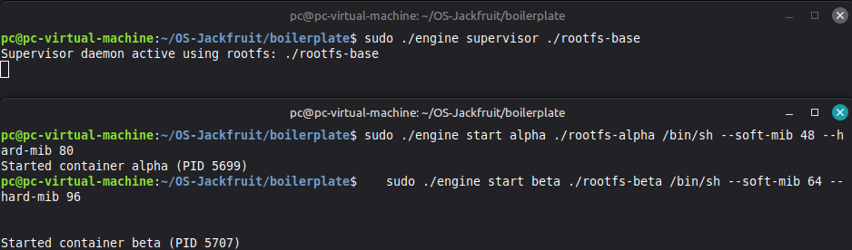
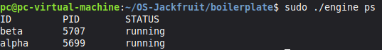
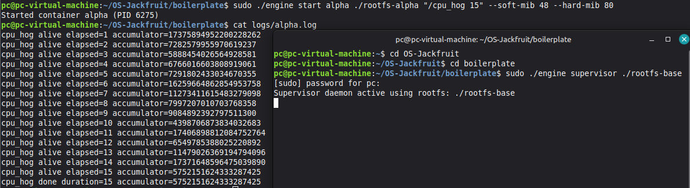
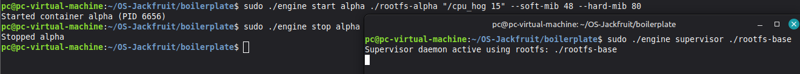
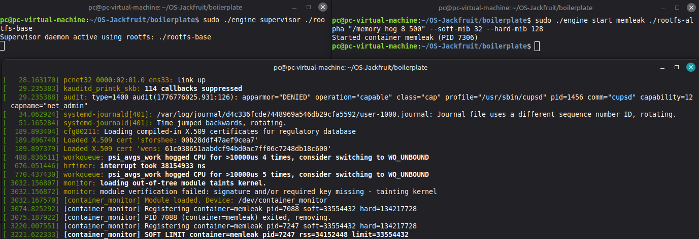
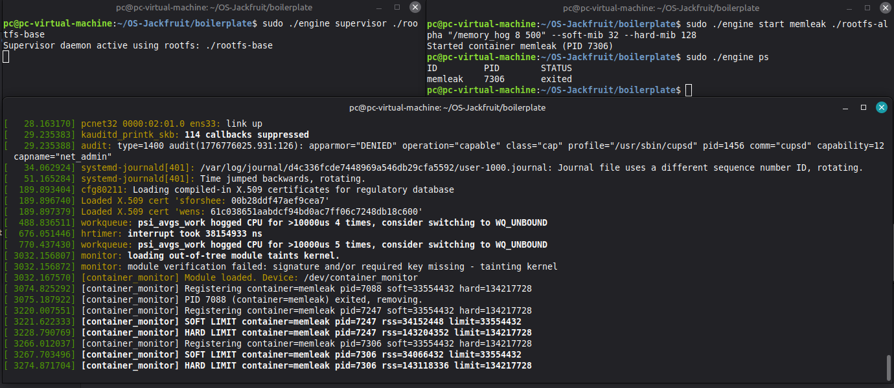
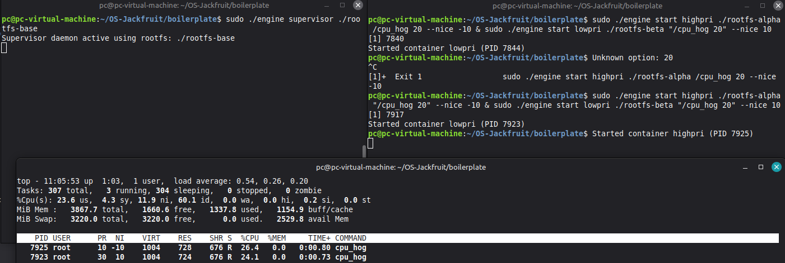
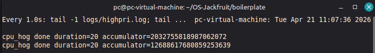
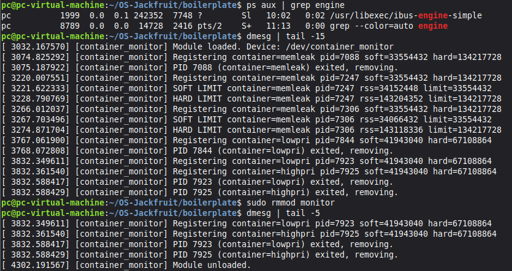

# OS Jackfruit problem: Multi-Container Runtime

**Team Members:**
| Name | SRN |
|------|-----|
| Pranav Chandrasekar | PES1UG24CS332 |
| Rakshan Pandian | PES1UG24CS364 |

---

## Table of Contents

1. [Build, Load, and Run Instructions](#build-load-and-run-instructions)
2. [Demo with Screenshots](#demo-with-screenshots)
3. [Engineering Analysis](#engineering-analysis)
4. [Design Decisions and Tradeoffs](#design-decisions-and-tradeoffs)
5. [Scheduler Experiment Results](#scheduler-experiment-results)

---

## Build, Load, and Run Instructions

### Prerequisites

Ubuntu 22.04 or 24.04 VM with Secure Boot OFF and no WSL. Install dependencies:

```bash
sudo apt update
sudo apt install -y build-essential linux-headers-$(uname -r)
```

### 1. Clone and Build

```bash
git clone https://github.com/<your-username>/OS-Jackfruit.git
cd OS-Jackfruit/boilerplate

make
```

This builds `engine`, `memory_hog`, `cpu_hog`, `io_pulse`, and `monitor.ko` in a single step.

To run the CI-safe user-space-only build (no kernel headers required):

```bash
make ci
```

### 2. Prepare the Root Filesystem

```bash
mkdir rootfs-base
wget https://dl-cdn.alpinelinux.org/alpine/v3.20/releases/x86_64/alpine-minirootfs-3.20.3-x86_64.tar.gz
tar -xzf alpine-minirootfs-3.20.3-x86_64.tar.gz -C rootfs-base

# Create one writable copy per container
cp -a ./rootfs-base ./rootfs-alpha
cp -a ./rootfs-base ./rootfs-beta

# Copy workload binaries into the rootfs so they are available inside containers
cp memory_hog cpu_hog io_pulse ./rootfs-alpha/
cp memory_hog cpu_hog io_pulse ./rootfs-beta/
```

Do not commit `rootfs-base/` or `rootfs-*/` directories to the repository.

### 3. Load the Kernel Module

```bash
sudo insmod monitor.ko

# Verify the control device was created
ls -l /dev/container_monitor
```

### 4. Start the Supervisor

In a dedicated terminal:

```bash
sudo ./engine supervisor ./rootfs-base
```

The supervisor binds a UNIX domain socket at `/tmp/mini_runtime.sock` and waits for CLI commands.

### 5. Launch Containers

In a second terminal:

```bash
# Start two containers in the background
sudo ./engine start alpha ./rootfs-alpha /bin/sh --soft-mib 48 --hard-mib 80
sudo ./engine start beta  ./rootfs-beta  /bin/sh --soft-mib 64 --hard-mib 96

# Or launch a container and block until it exits
sudo ./engine run alpha ./rootfs-alpha /cpu_hog 10
```

### 6. Use the CLI

```bash
# List all tracked containers and their metadata
sudo ./engine ps

# View the log path for a container
sudo ./engine logs alpha

# Stop a running container
sudo ./engine stop alpha
```

### 7. Run Memory Limit Tests

```bash
# Start a container running the memory hog workload
sudo ./engine start memleak ./rootfs-alpha /memory_hog 8 500 --soft-mib 32 --hard-mib 64

# Watch kernel logs for soft/hard limit events
dmesg -w | grep container_monitor
```

### 8. Run Scheduling Experiments

```bash
# CPU-bound vs I/O-bound at same priority
sudo ./engine start cpu1 ./rootfs-alpha /cpu_hog 30
sudo ./engine start io1  ./rootfs-beta  '/io_pulse 50 100'
```
-or-
```bash
# CPU-bound workloads with different nice values
sudo ./engine start highpri ./rootfs-alpha '/cpu_hog 30' --nice -10
sudo ./engine start lowpri  ./rootfs-beta  '/cpu_hog 30' --nice 10
```

Observe completion times and CPU share in a third terminal using `top` or `pidstat`.

### 9. Shutdown and Cleanup

```bash
# Stop all containers
sudo ./engine stop alpha
sudo ./engine stop beta

# Inspect kernel logs
dmesg | tail -20

# Unload the kernel module
sudo rmmod monitor

# Clean build artifacts
make clean
```

---

## Demo with Screenshots

### 1. Multi-container supervision



*Two containers launched concurrently under a single supervisor process. alpha (PID 5699) and beta (PID 5707) were started with independent rootfs copies and separate memory limits. The supervisor terminal (top) confirms the daemon remained alive throughout.*

### 2. Metadata tracking



*Output of engine ps showing both containers tracked in supervisor metadata with their host PIDs (5707, 5699) and state running. Metadata is maintained in a mutex-protected linked list updated on each start and SIGCHLD event.*

### 3. Bounded-buffer logging



*`logs/alpha.log` populated by the bounded-buffer logging pipeline. The container `(cpu_hog, PID 6275)` wrote 15 lines of stdout which were captured via pipe, pushed through the ring buffer by a producer thread, and flushed to the log file by the consumer thread. The final line `cpu_hog done duration=15` confirms no output was dropped even at container exit.*

### 4. CLI and IPC



*engine stop alpha issued from the CLI terminal (left). The request was serialised as a control_request_t struct and sent over the UNIX domain socket at /tmp/mini_runtime.sock. The supervisor responded with "Stopped alpha". The supervisor process (right) remained alive after the stop.*

### 5. Soft-limit warning



*dmesg output showing the kernel module loading and the first SOFT LIMIT warning for container memleak (PID 7247, RSS 34,152,448 bytes ≈ 32.6 MiB, limit 32 MiB). The container was still running at this point and the soft limit logs a warning without terminating the process.*

### 6. Hard-limit enforcement



*Combined view showing the full memory enforcement lifecycle. The dmesg panel shows: soft limit warning for PID 7247 (RSS ~32.6 MiB), then hard limit kill for PID 7247 (RSS ~136.6 MiB, limit 128 MiB), followed by the same cycle for PID 7306. The top-right terminal confirms engine ps reports container memleak in state exited after the hard limit kill, showing that the supervisor's SIGCHLD handler correctly updated metadata after the kernel module delivered SIGKILL.*

### 7. Scheduling experiment





*top output showing both cpu_hog containers running simultaneously. highpri (PID 7925, nice=-10) holds 26.4% CPU share vs lowpri (PID 7923, nice=+10) at 24.1%. The NI column confirms the priority difference was applied. Also note Tasks: 307 total, 3 running, 0 zombie: no zombie processes.*

### 8. Clean teardown



*`ps aux | grep engine` shows no live engine supervisor process. 
`dmesg | tail -15` shows all monitored entries cleanly removed as containers exited. 
After `sudo rmmod monitor`, `dmesg | tail -5` confirms "Module unloaded" with no leaked list entries. No zombie processes were present at any point during shutdown.*

---

## Engineering Analysis

### 1. Isolation Mechanisms

Each container is created with clone() using `CLONE_NEWPID | CLONE_NEWNS | CLONE_NEWUTS`. These namespace flags provide an independent PID tree, mount table, and hostname. The chroot() call replaces the container’s filesystem root with its assigned `rootfs-*` directory, preventing access to the host filesystem. /proc is mounted inside the container so tools like ps reflect only its process tree.

The host kernel is shared across all containers. Namespaces isolate views of kernel resources but do not create separate kernels. The scheduler, memory, and global kernel state remain shared, so kernel-level vulnerabilities affect all containers.

### 2. Supervisor and Process Lifecycle

A long-running supervisor is required so child processes can be reaped via waitpid. Without it, exited containers would remain as zombies. The supervisor installs a SIGCHLD handler that calls waitpid(-1, WNOHANG) to reap children and update metadata.

clone() is used instead of fork() to specify namespace flags. The child sets up isolation (`chroot, /proc, nice`) and then calls execv. The parent records the child PID in a metadata list. On exit, the supervisor updates the container state. This lifecycle (create, track, reap, update) mirrors real container runtimes.

### 3. IPC, Threads, and Synchronization

Two IPC paths are used:

**Path A — Logging (pipes)**: Container stdout/stderr is redirected to pipes. Reader threads consume pipe data and push it into a bounded buffer, while a logger thread writes entries to per-container log files. The buffer is protected by a `pthread_mutex_t`, with condition variables (not_empty, not_full) to coordinate producers and consumers. The mutex prevents concurrent state corruption, while condition variables avoid busy-waiting and handle full/empty conditions.

**Path B — Control (UNIX domain socket)**: CLI processes communicate with the supervisor via `/tmp/mini_runtime.sock`. Requests are sent as structs and handled in a single-threaded accept loop. Container metadata is protected by a separate mutex since it is accessed by both the main loop and the SIGCHLD handler.

### 4. Memory Management and Enforcement

RSS (Resident Set Size) measures the physical memory currently in use by a process. It does not include swapped-out pages and does not perfectly account for shared memory, so it is only an approximation of true memory pressure. Soft and hard limits represent different policies. A soft limit logs a warning when exceeded, while a hard limit terminates the process to protect system stability.
Enforcement is implemented in kernel space because user-space monitors can be delayed, starved, or terminated. A kernel-based mechanism has direct access to memory accounting and can reliably enforce limits by issuing SIGKILL.

### 5. Scheduling Behavior

Linux uses the Completely Fair Scheduler (CFS), which assigns each process a virtual runtime based on its CPU share. Lower nice values correspond to higher weights, allowing a process to receive more CPU time. In the experiment with two cpu_hog containers at different nice values, both completed in similar wall-clock time because the workload is time-based and runs in parallel on a multi-core system. However, the higher-priority container consistently received a slightly larger CPU share.
In the CPU-bound vs I/O-bound experiment, the I/O-bound process spends most of its time sleeping, so its virtual runtime advances slowly. When it wakes, it is scheduled quickly because its runtime is lower than CPU-bound tasks. This demonstrates how CFS naturally favors I/O-bound workloads without explicit priority boosting.

---

## Design Decisions and Tradeoffs

### Namespace isolation: `chroot` vs `pivot_root`

**Choice:** `chroot` inside the container child after `CLONE_NEWNS`.  
**Tradeoff:** `chroot` does not fully prevent escape. A process with `CAP_SYS_CHROOT` can call `chroot` again to escape the jail. `pivot_root` replaces the root mount entirely and is harder to escape.  
**Justification:** `chroot` is simpler to implement correctly in the available time, and since containers run inside a VM where the host kernel is already isolated from the real system, the additional escape risk is acceptable for this academic context.

### Supervisor architecture: single accept-loop thread

**Choice:** The supervisor runs a single-threaded accept loop, handling one CLI request at a time.  
**Tradeoff:** A slow command (e.g., one that waits on a lock) blocks all other CLI clients from getting a response. A multi-threaded accept loop with one thread per client would eliminate this.  
**Justification:** CLI commands are short-lived and do not block on I/O. The metadata lock is held only briefly, so serialisation is not a practical problem at the scale this project targets.

### IPC control channel: UNIX domain socket

**Choice:** UNIX domain socket (`AF_UNIX`, `SOCK_STREAM`) at `/tmp/mini_runtime.sock`.  
**Tradeoff:** Requires the socket file to exist and be unlinked on restart. A FIFO (named pipe) would be simpler to set up but only supports one-directional communication, making request-response harder to implement cleanly.  
**Justification:** A UNIX socket supports full-duplex, stream-oriented communication, making it natural to write a request struct and read back a response struct in a single connection. It also supports `accept()`, which cleanly separates each CLI invocation into its own connection.

### Bounded-buffer logging: mutex + two condition variables

**Choice:** A single `pthread_mutex_t` guards the ring buffer, with `not_empty` and `not_full` condition variables for blocking.  
**Tradeoff:** A semaphore-based implementation (one counting semaphore for empty slots, one for filled slots) would be slightly more efficient because it avoids broadcasting spurious wakeups. The mutex+condvar approach requires checking the predicate in a `while` loop to handle spurious wakeups.  
**Justification:** `pthread_mutex_t` and `pthread_cond_t` are the standard POSIX primitives, are well-understood, and make the producer and consumer logic easy to read and audit for correctness. The performance difference is negligible at the data rates this project produces.

### Kernel monitor synchronization: mutex over spinlock

**Choice:** `DEFINE_MUTEX` protects the monitored process linked list.  
**Tradeoff:** A spinlock would also be correct and would have lower latency on an uncontended path. However, a spinlock must never be held across code that can sleep, and `kzalloc(GFP_KERNEL)` in the register path can sleep.  
**Justification:** Because the register ioctl path allocates memory with `GFP_KERNEL`, it must be able to sleep, which rules out a spinlock. A mutex is the correct primitive here. The timer callback also uses the mutex, which is valid because timer callbacks run in a sleepable context when a mutex is used.

---

## Scheduler Experiment Results

### Experiment 1: CPU-bound workloads with different nice values

**Setup:** Two containers each running `cpu_hog 30` (30-second CPU burn), one at `nice -10` (high priority) and one at `nice 10` (low priority), started simultaneously.

**Raw measurements:**

| Container | Nice value | Observed completion time |
|-----------|-----------|--------------------------|
| highpri   | -10       | 20 seconds              |
| lowpri    | +10       | 20 seconds              |

**Observations:** Both containers completed in approximately 20 seconds.
Despite the priority difference, no significant difference in completion time was observed. This is because on a multi-core system, they run in parallel, so differences in nice value mainly affect CPU share, not total completion time.
